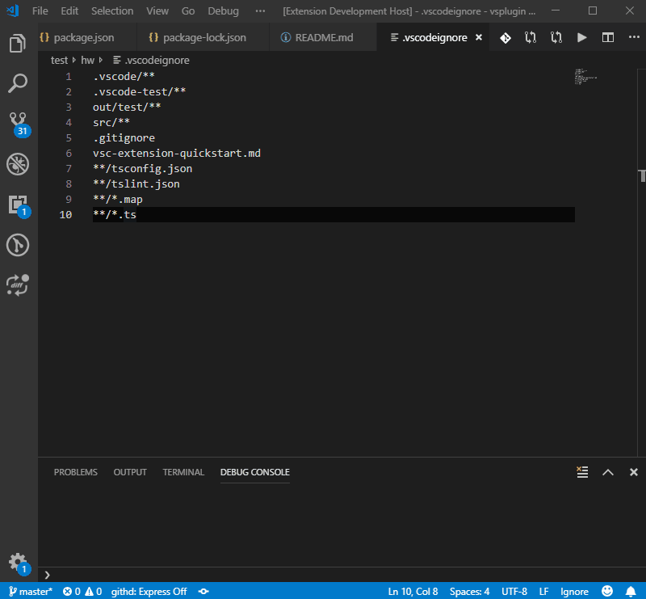

# Tab Keeper
## Usage
1. Type `save tabs` into the command palette.  
    Current tabs are going to be saved.
2. Type `pop tabs` into the command palette.  
    Saved tabs are going to be poped.

## Tab keeper : Save tabs

## Tab keeper : Pop tabs
